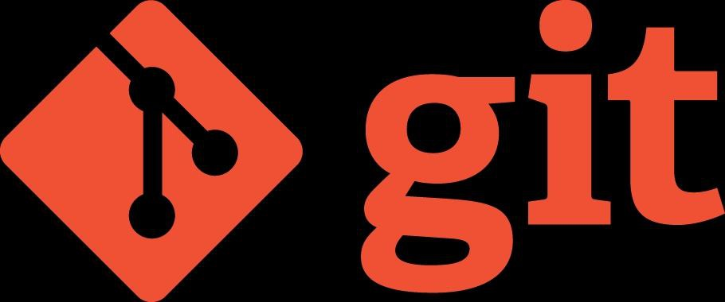
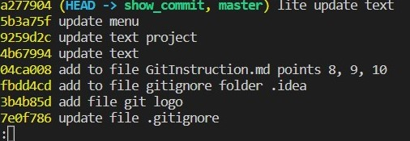
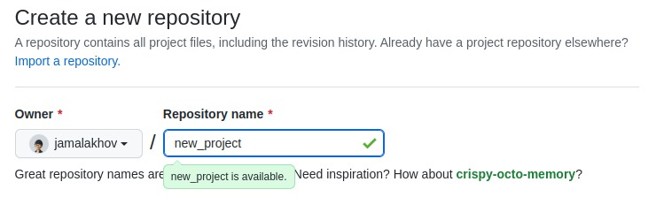
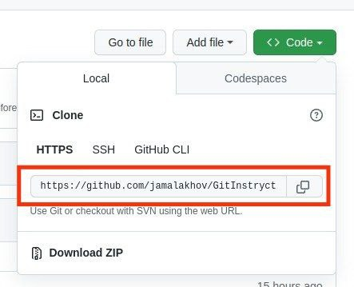

# Инструкция по работе с Git

## Меню

<ol>
  <li><a href=#1-проверка-наличия-установленного-git>Проверка наличия установленного Git</a></li>
  <li><a href=#2-установка-git>Установка Git</a></li>
  <li><a href=#3-настройка-git>Настройка Git</a></li>
  <li><a href=#4-инициализация-репозитория>Инициализация репозитория</a></li>
  <li><a href=#5-добавление-файла-на-отслеживание>Добавление файла на отслеживание</a></li>
  <li><a href=#6-создание-коммита>Создание коммита</a></li>
  <li><a href=#7-просмотр-коммитов-и-перемещение-между-ними>Просмотр коммитов и перемещение между ними</a></li>
  <li><a href=#8-работа-с-ветками>Работа с ветками</a></li>
  <li><a href=#9-конфликты-слияние-веток-и-их-разрешение>Конфликты слияние веток и их разрешение</a></li>
  <li><a href=#10-игнорирование-файлов>Игнорирование файлов</a></li>
  <li><a href=#11-работа-с-удаленным-репозиторием>Работа с удаленным репозиторием</a></li>
</ol>

## [1. Проверка наличия установленного Git](#меню)

Перед началом работы убедитесь, что на вашем устройстве установлена система контроля версий **Git**. Для это в терминале выполнить команду `git --version`. Если **Git** установлен, то появится сообщение следующего вида (номер версии может отличаться от примера):

> git version 2.34.1

Если вы видите сообщение, которое похоже на пример выше, то все в порядке и можно приступать к работе. В противном же случае перейдите к [пункту 2](#2-установка-git).

## [2. Установка Git](#меню)

Загружаем последнюю версию **Git** с [сайта](https://git-scm.com/download) и устанавливаем с настройками по умолчанию.
Если вы работаете под операционной системой *Linux*, то можете осуществить установку **Git**, выполнив следующие команды в терминале:

  sudo apt update
  sudo apt install git

После завершения процесса установки убедитесь, что все прошло корректно, повторив команду `git --version`.

Сравните полученный результат с примером из [пункта 1](#1-проверка-наличия-установленного-git).

## [3. Настройка Git](#меню)

При первом запуске **Git**, после успешной установки, вам необходимо "представиться" в системе контроля версий. Для этого нужно ввести в терминал следующие команды:

  git config --global user.name "Ваше имя"
  git config --global user.email email@example.com

Данная настройка необходима для того, чтобы в процессе создания *commit* другие пользователи системы контроля версии знали автора и его почту для связи.

Далее, чтобы убедиться в том, что все прошло успешно, выполните следующую команду в терминале `git config --global -l`.

В терминале вам должны отобразится введенные вами данные в следующем виде:
>user.name=Ваше имя
>
>user.email=Ваша почта

Поздравляю! **Git** настроен и можно приступать к работе.

## [4. Инициализация репозитория](#меню)

Следующим шагом на пути освоения работы с **Git** является создание репозитория.
Придерживайтесь следующего алгоритма:

1. Создайте папку, в которой будет располагаться ваш будущий проект.
2. С помощью терминала перейдите в созданную папку.
3. Для начала убедитесь, что ваша новая папка не содержит в себе репозитория.
    1. Для этого выполните команду `git status`. Если все хорошо, то вы увидите следующее сообщение:
    >fatal: не найден git репозиторий (или один из родительских каталогов): .git

    Можно переходить к следующему шагу.

    2. Если же вы увидели сообщение с текстом: "Текущая ветка: 'имя_ветки'_", то удалите текущую папку и повторите пункт 1.

4. Выполните в терминале команду `git init`.

Репозиторий инициализирован. Чтобы убедиться в этом выполните команду `git status`. В терминале должен отобразиться следующий текст:
>"Текущая ветка: master
>
>Еще нет коммитов_".

Репозиторий инициализирован и готов к отслеживанию файлов.

## [5. Добавление файла на отслеживание](#меню)

Создайте файл внутри вашей папки.
Выполните команду `git status`. В терминале отобразится следующий результат выполнения:
>Текущая ветка: master
>
>Еще нет коммитов
>
>Неотслеживаемые файлы:
>(используйте «git add <файл>...», чтобы добавить в то, что будет включено в коммит) 'имя файла'
>
>индекс пуст, но есть неотслеживаемые файлы
(используйте «git add», чтобы проиндексировать их)

Чтобы добавить файл на отслеживание, выполните команду `git add имя_файла`.

Снова выполните команду `git status` для просмотра статуса файла:
>Текущая ветка: master
>
>Еще нет коммитов
>
>Изменения, которые будут включены в коммит:
>(используйте «git rm --cached <файл>...», чтобы убрать из индекса) новый файл: 'имя файла'

Ваш файл успешно добавлен в индекс и можно сделать первый коммит.

Если же мы по ошибке добавили какой-то файл в индекс, то его можно исключить при помощи команды `git rm --cached <file_name>`.

## [6. Создание коммита](#меню)

После добавление файла в индекс можно сделать свой первый коммит (фиксация изменений).

`git commit -m "first commit"`

Параметр `-m` указывает на то, что далее в кавычках следует описание тех изменений, которые мы хотим зафиксировать. Данный параметр обязателен при вызове команды *commit*.
Если сейчас мы запустим команду `git status` то увидим следующий результат:
>Текущая ветка: master
>
>нечего коммитить, нет изменений в рабочем каталоге

Коммит успешно зафиксирован.

Кроме того, можно совместить добавление файла в индекс и создание коммита с помощью команды

`git commit -am <message>`

## [7. Просмотр коммитов и перемещение между ними](#меню)

Итак, что мы имеем:

* **Git** настроен
* Репозиторий инициализирован (`git init`)
* Файл создан и добавлен на отслеживание (`git add`)
* Первый *commit* зафиксирован (`git commit -m`)

Настало время посмотреть наши **коммиты**. Для этого нужно выполнить команду `git log`.

Результат данного запроса будет выглядеть примерно следующим образом:
>commit хэш-коммита (HEAD -> master)
>
>Author: Ваше имя <Ваша почта>
>
>Date:   Дата и время создания
>
>Текст коммита

В терминале отобразятся **все** коммиты, которые содержит текущая ветка (в нашем примере это ветка *master*).

Для навигации по коммитам используется команда `git checkout <commit-hash>`.

Так как **хэш** очень длинный, то можно использовать первые 5-6 его символов.

`git checkout <commit-hash>` вернет нам состояние файла, которое было на момент создания этого коммита.

Таким образом, зная хэш коммита, можно переключиться на любой из известных.

Кроме того, существует несколько способов компактного отображения списка коммитов. Один из таких - использование команды `git log --oneline`. В результате выполнения данной команды мы получим следующий вывод в консоль:

Как видим, нам отобразился компактный вариант представления: 7 первых символов хэша и текст коммита.

**ВАЖНО!**

---
При переключении между коммитами обязательно возвращайтесь к самому **актуальному** коммиту:

`git checkout branch_name`

### Откат изменений

Порой случаются такие ситуации, когда нам необходимо отменить определенный коммит. Рассмотрим несколько вариантов работы.

1. **git reset**

    `git reset <commit-hash>`

    Данная команда сбрасывает состояние нашего репозитория до определенного коммита и **удаляет** коммиты из истории которые следуют после того коммита, хэш которого мы указали в команде.

    Чтобы посмотреть **расширенную** версию истории выполним команду

    `git reflog`

    Нам отобразится история всех наших действий в **Git**. В этой же истории мы найдем запись того момента, когда мы удаляли наш коммит. Чтобы его восстановить, выполним известную нам команду

    `git reset <delete_commit-hash>`

2. **git revert**

    `git revert <commit-hash>`

    Данная команда создает **новый** коммит, который отменяет действие того коммита, хэш которого мы указали в команде. Отмененный коммит **сохраняется** в истории.

---

## [8. Работа с ветками](#меню)

Ранее мы уже рассматривали команды для работы с ветками. Давайте вспомним их, а также добавим новые команды.

1. `git branch` - просмотр всех доступных веток
2. `git branch <branch_name>` - создание новой ветки
3. `git checkout <branch_name>` - переключение на ветку
4. `git switch <branch_name>` - переключения на ветку (поддерживается в Git начиная с версии 2.23)
5. `git checkout -b <branch_name>` - создание новой ветки и переключение на нее
6. `git switch -c <branch_name>` - создание ветки и переключение на нее (начиная с версии Git 2.23)
7. `git switch -` - перемещение на предыдущую ветку
8. `git branch --move <old_branch_name> <new_branch_name>` - переименование ветки
9. `git branch -d <branch_name>` - удаление ветки

Это далеко не весь перечень команд по работе с ветками, а только основные. Начиная с версии 2.23 была добавлена узкоспециальная команда `switch`, которая отвечает только за переключение между ветками, в то время как функционал `checkout` куда более шире. Поэтому рекомендуется в обновленной версии **Git** для переключения между ветками пользоваться именно `switch`.

В общем смысле, механизм работы в разных ветках нужен для того, чтобы локализовать реализацую конкретной задачи от всего проекта, так сказать, создать "черновик", который в дальнейшем мы можем объеденить (слить) с основным проектом.

Поэтому далее мы рассмотрим механизм слияния веток.

Итак, мы создали наш "черновик", наполнили его новым кодом, сохранили изменения и сделали коммиты и теперь настало время объеденить его с основной веткой проекта. Для этого мы сначала перейдем на ветку **в которую** будем "вливать" черновик: `git switch master`.

Далее выполним следующую команду `git merge <branch_name>`, где `branch_name` - имя ветки **из которой** мы переносим изменения.

После успешного слияния можно удалить ветку, **из которой** переносили изменения: `git branch -d <branch_name>`.

---
Есть некоторые особенности удаления веток: если в ветке присутствуют несмерженные изменения или незапушенные коммиты, флаг *-d* не позволит удалить такую локальную ветку. Это связано с тем, что эти коммиты нигде более не отслеживаются, и **Git** защищает вас от случайной потери этих данных. Поэтому сначала мерджим данные, а затем удаляем ветку. Однако, можно сделать принудительное удаление ветки: для это используем флаг *-D*. После ввода этого флага у вас не будут просить подтверждение удаления. Прибегайте к ней только когда абсолютно уверены, что хотите удалить локальную ветку.

---

## [9. Конфликты слияние веток и их разрешение](#меню)

Конфликт слияния веток- достаточно распространенная ситуация, когда над проектом работает несколько человек. Если была изменена одна и та же часть одного и того же файла по-разному в двух объединяемых ветках, **Git** не сможет их чисто объединить и остановит процесс до тех пор, пока вы не разрешите конфликт. В конфликтующие файлы **Git** добавляет специальные маркеры конфликтов, чтобы вы могли исправить их вручную. Чтобы разрешить конфликт, придётся выбрать один из вариантов, либо объединить содержимое по-своему.
После того, как конфликт решен, необходимо модифицированный файл добавить в индекс и закоммитить изменения.

## [10. Игнорирование файлов](#меню)

Часто на практике случаются ситуации, когда далеко не все файлы необходимо отслеживать. Именно для этого был реализован механизм игнорирования файлов. Для этого в корне проекта создается специальный файл **.gitignore** в котором перечисляются файлы, которые необходимо исключить из отслеживания. Например, к таким файлам могу относиться изображения. На примере посмотрим, как игнорировать файлы с расширением *.jpg*.

1. создаем файл *.gitignore*
2. добавляем в файл следующую запись: *\*.jpg*

Симлов (\*) означает, что будут игнорироваться все файлы расширения *.jpg* в не зависимости от имени файла.

## [11. Работа с удаленным репозиторием](#меню)

Для совместной работы над одним проектом необходимо обеспечить общий доступ для всех участников. Для этого будем использовать такой сервис как [**GitHub**](https://github.com/about).

1. Зарегистрируемся на [сервисе](https://github.com)
2. На локальном компьютере создадим папку для будущего проекта
3. Создадим репозиторий на удаленном сервисе, где регистрировались в пункте 1.

4. Выполним следующую инструкцию:
    * Инициализируем локальный репозиторий

      `git init`
    * Создадим файл *README.md* и добавим в индекс

      `git add README.md`
    * Выполним *first commit*

      `git commit -m "first commit"`
    * Свяжем локальный и удаленный репозиторий

      `git branch -M main`

      `git remote add origin https://github.com/jamalakhov/new_project.git`

      Чтобы убедиться в том, что соединение прошло успешно выполним команду

      `git remote -v`

      Результат успешного выполнения выглядит следующим образом

          origin  https://github.com/jamalakhov/git_instruction.git (fetch)
          origin  https://github.com/jamalakhov/git_instruction.git (push)
    * Загрузим файлы в удаленный репозиторий

      `git push -u origin main`

При первом обращении к удаленному репозиторию ваша среда разработки запросит регистрационные данные от вашего аккаунта. Следуйте инструкции, которая появится у вас на экране.

В дальнейшем, когда ваш удаленный репозиторий и среда разработки синхронизируются, команда для выгрузки данных будет выглядеть проще: `git push`.

Рассмотрим обратную ситуацию: проект уже имеется в удаленном репозитории и его нужно загрузить на локальный компьютер. Для этого:

1. Создадим папку, в которую будем загружать проект, и убедимся, что в этой папке **не инициализирован** репозиторий
2. Откроем в удаленном репозитории интересующий нас проект и скопируем его адрес

    
3. Перейдем в папку, которую создали в пункте 1 и выполним команду

    `git clone <path>`
  
    В результате, проект из удаленного репозитория *клонируется* в нашу исходную папку.

4. Перейдем непосредственно в папку клонированного проекта и выполним команду `git status`, чтобы убедиться в успехе проделанной операции.

    В результате мы увидим информацию о том, что наш локальный репозиторий инициализирован и связан с удаленным.

Итак, удаленный репозиторий создан и связан с локальным. Мы смело *пушим* все имзменения из локального репозитория в удаленный. Но как сделать наоборот: загрузить изменения из удаленного репозитория в локальный? Все просто, нужно выполнить команду `git pull`. Все изменения подтянутся к локальному репозиторию, выполнится *merge* и если возникнет конфликт слияния, то его необходимо разрещить также, как и при слиянии веток.

## Это далеко не все команды, а только основа для начала работы с **Git**
